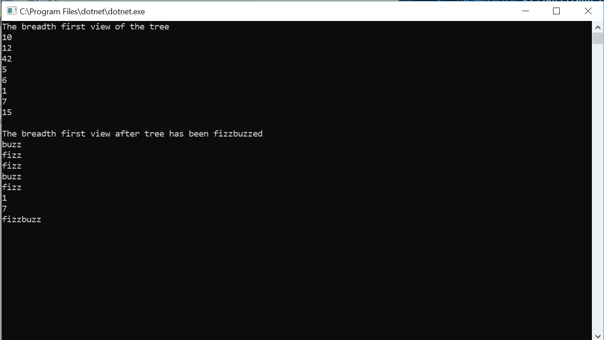

# Tree - FizzBuzzTree
To further our knowledge on data structures and algorithms, we will be manipulating Trees.

## Challenge
Create a method that takes in a tree and change its value to "fizz" if it is divisible 
by 3, "buzz" if divisible by 5, and "fizzbuzz" if divisible by 3 and 5. If none of the 
above, do not change the number. Do this for each of the node within the tree.
Return the manipulated tree.

## Solution

