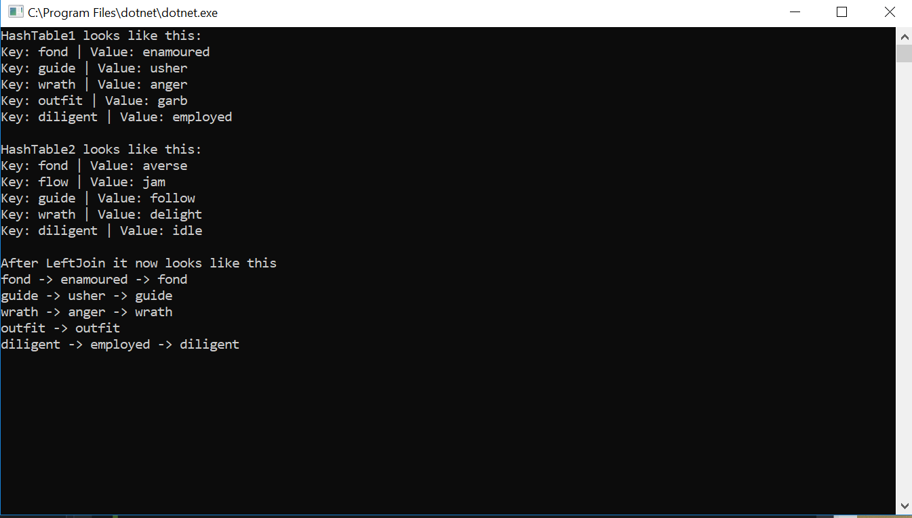

# HashTable LeftJoin
To further our knowledge on data structures and algorithms, we will be manipulating HashTable.

## Challenge
Create a method called Left Join that joins the two given hash maps. One hash map 
has a string key that holds a word and the string value that holds the synonym.
Another hash table has a string key and a string value with an antynoms. 
If the key that exists in the first hashmap also exists in the second hashmap,
attach the value of the second hashmap to the key -> value -> value(2).
The returned data can be of any structure.

## Solution

