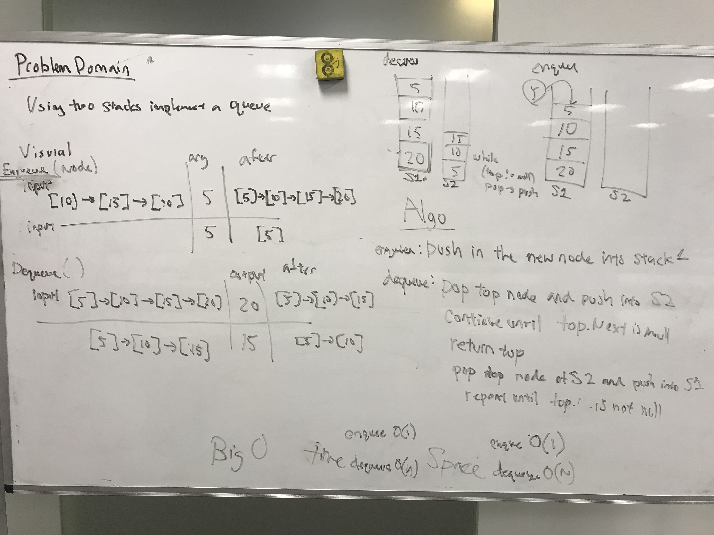

# Stack and Queue - Queue with Stacks
To further our knowledge on data structures and algorithms, 
we will be manipulating Stacks and Queues

## Challenge
Write a method in the Queue Class which takes two Stacks and implement
the same functionality as Queue data structure. The Queue made from two
Stacks must have First In First Out behavior and be able to Enqueue 
(Add a new node), and Dequeue (return and remove the "Front" node).

## Solution

