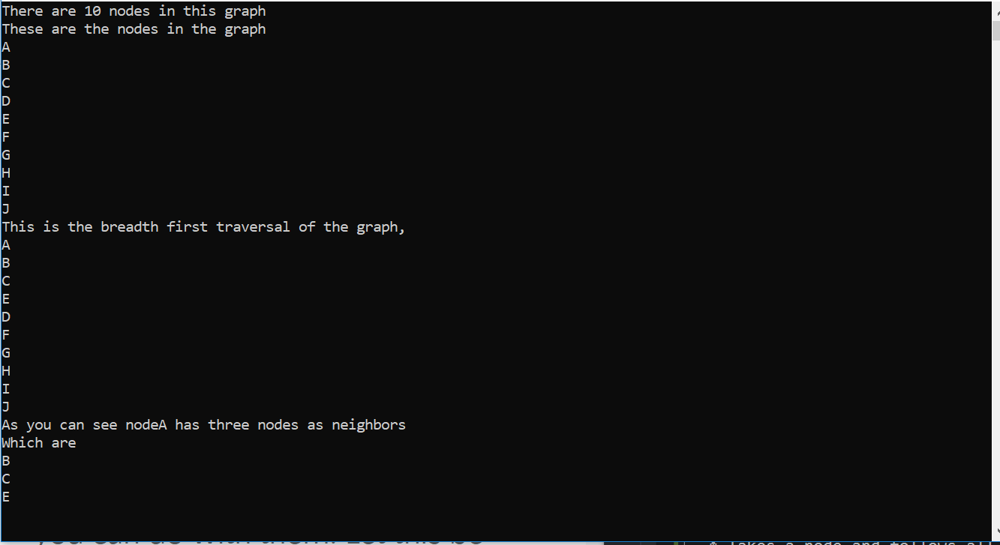
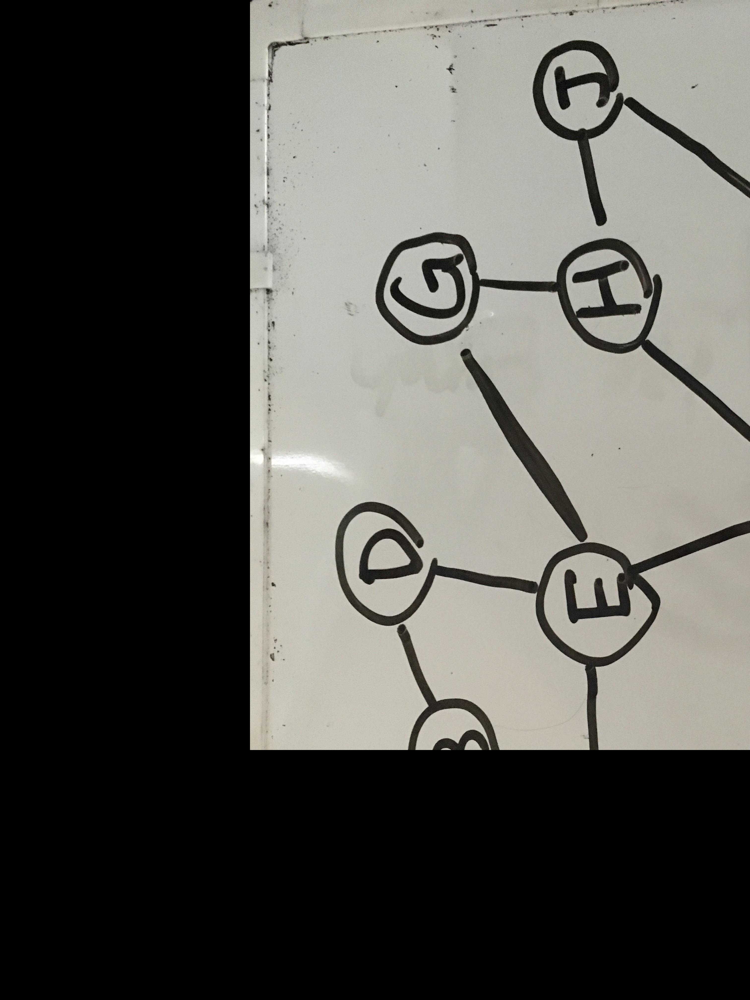

# Graph
Introduction to understanding Graph.

## What Is It?
Graph is a data structure that is created with nodes/vertices. Each node can be connected
to any number of other nodes. These connections are refered to as edges. The number of 
edges a node has is called degree and the nodes connected are neighbors of said node.

Edges can be given direction. If it is not, it is bi-directional. Edges can also be weighted by given a value.

Completed Graphs are graphs in which all its nodes is connected to all other nodes within
that graph. Connected graphs are where each node has at least one edge and from one node
can be traversed to any node within the graph. Disconnected graphs have island nodes that
are not connected. Graphs can be cyclic or acyclic. Bidirectional graphs are acyclic, 
while graphs that can create a full cycle are known as cyclic.

## Representation
The two ways of representing graphs are...
* Adjacency Matrix
  * A 2D array that hold numberical booleans (0 for false and 1 for true). 1 is given for anywhere an edge exists between two nodes
* Adjacency List
  * A Linked List or List or Collection of Nodes each node has an edge to.

## Traversal
Nodes are given a visited boolean property so check if the node has been visited or not
Two main ways of traversal are...
* Breadth First
  * Takes a node and fills a list starting from the neighbor of the given node and moving out
  * Uses a Queue
* Depth First
  * Takes a node and follows all its children until there is no child to a node. As it returns back it enters the node to a list
  * Uses a Stack 

## Solution

