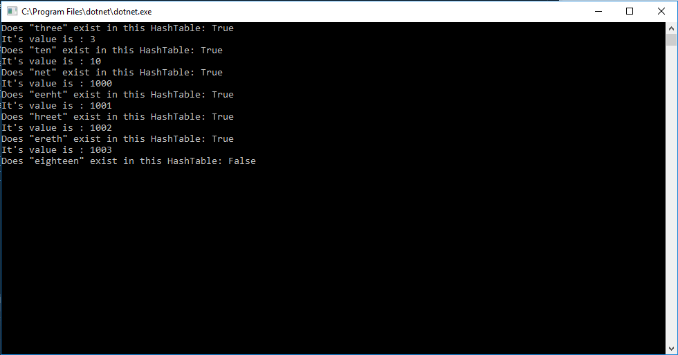

# HashTable
Introduction to understanding Hash Tables.

## What Is It?
Hash Table is a type of Data structure. It is an array of arbitrary size (often set at 1024). A key,
value pair is needed to store data into a hash table. The key is first hashed using a some sort
of logic and given an integer that corresponds to an index in the array. That is where the key and
value will be stored. 

In a perfect hash table, each key-value will have its own space in the array. 

When a key is hashed and given a index, it can sometimes overlap with a previously added key. This
collsion is solved by Linked List or other fundamental data structures. We would then add the new 
key and value with an O(1) insertion as a linked list to the array.

The power of a hash tables come from its Big O in finding the value given a key. 

In a perfect hash table it is O(1)

In a LinkedList hash table it is O(n/k)

In a binary search tree hash table it is O(n/log(n))

## Methods
In a hash table, we have
* Add(key, value) - adds a key and value after the key has been hashed to a place in the array

* Find(key) - finds and returns the value with a given key in a hash table
* Contains(key) - returns true if the key exists in a hash table, false if it doesnt exist

## Solution

