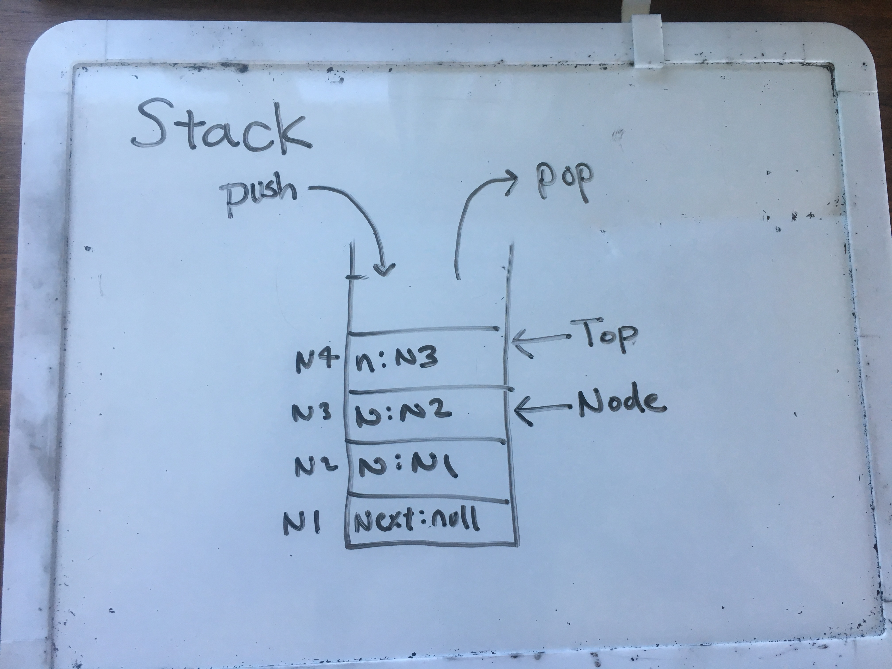
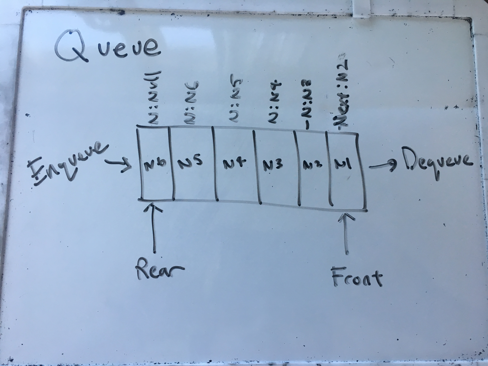

# Stacks and Queues
Introduction to understanding Stacks and Queues.

## What is Stack?
Stack is a type of data structure. Similarly to Linked Lists(LL), stacks are composed of Nodes which has two propety, a value and Next that points to a Node. 
Unlike LL, stacks push to add nodes, pop to remove them. The key different is that for stacks, first node to enter is the last to be taken out of it. 
There is a reference to the latest node added to the stack called Top. Top is reassigned when a node is pushed or popped. Stacks have a Peek method that
checks if the Top node is the last node in the stack so that it doesnt get popped off.
Stacks are used in compile time memory management, for effecient algorithms, backtracking, etc.

## What is Queue?
Queue is also a data structure that is comprised of nodes. However, the first node that enters the Queue is also the first one out. The process of adding 
a node is called Enqueue and taking it out is Dequeue. Queues have a reference to the first node that was added, Front, and the latest node that was added, Rear.
Similarly to Stack, Queue also has a peek method to check if the Front node is not the only node in the Queue. Queues are used in "buffer"
between two systems, programs, or prcesses. It can also be used to maintain a list of processes that are ready to excecute but waiting for 
an event to occur.

## Challenge
Implement the Link list by creating a Node Stack, Queue class. Within the Stack and Queue class, create the following methods appropriate for each class.
* Push - O(1) add a Node before the Top for Stacks
* Pop - O(1) return the Node at the Top of the stack, remove the returned node from the stack and reassign the Top. Temp is necessary
* Peek - O(1) returns the Top of the stack.

* Enqueue - O(1) add a Node after the Rear of the Queue, reassign the Rear
* Dequeue - O(1) return the Front of the Queue. Remove the Front of the Queue from the Queue and reassign the Front. Temp is necessary
* Peek - O(1) return the Front of the Queue
* We were not allowed to use methods that are available through Visual Studio.
Create a Node class, LinkList class, and unit testing to see if functionality is valid

## Solution

