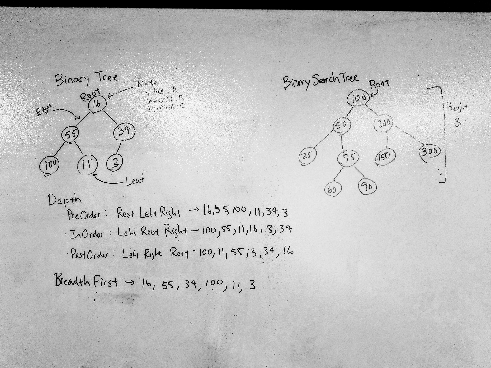

# Binary Tree and Binary Search Tree
Introduction to understanding Binary Tree and Binary Search Tree

## What is a tree?
In Computer Science, tree is a way to hold data, a data structure. Trees are composed of
nodes with three properties, a value, and two nodes that points to left or right. The connection between nodes is called edges and the number of edges 
for each new layer is the height of the tree. Nodes without edges are called leaf. The first node to start the tree is known as the Root.
To traverse a tree there are two ways Depth First and Breadth First.
Depth First can be split up into threww traversals.
* PreOrder - Root, Left, Right
* InOrder - Left, Root, Right
* PostOrder - Left, Right, Root
* Breadth First - Traverse through the tree by going through each level of the tree, node by node

## What is Binary Tree?
Stack is a type of data structure. It is comprised of nodes that has three properties:
a number datatype value, Node LeftChild, and Node RightChild. Binary tree has no
specific sorting order. When adding a new node, the new node's location is not restricted. Binary trees have an Add method,
to add new nodes to the tree, and Search methods to look for and return a node from the tree. 

## What is Binary Search Tree?
Much like the binary tree, binary search tree is composed of nodes that are the same as binary trees. However, binary search trees are organized 
so that any new node added are dependant on the root of the tree. If the node added has a value smaller than the root's value, it is added to the left child.
If bigger, added to the right. If child nodes already exist, the child node now becomes the "root" and is used to decide where the next node will be added.
Binary search trees also have an Add and Search method.

## Challenge
Implement the Binary Tree and Binary Search Tree. Create the 4 ways of travering the trees and add and search methods for each type of tree. 

## Solution

